# 디자인 문서: 테라폼 케이스별 예제

## 개요

본 프로젝트는 테라폼 인프라 코드의 세 가지 대표적인 구성 패턴을 예제로 제공합니다. 각 케이스는 독립적으로 동작하며, AWS 프로바이더와 S3+DynamoDB 백엔드를 공통으로 사용합니다. 실제 배포를 목적으로 하지 않지만, 실제 코드 형태를 유지하여 학습 및 참고 자료로 활용할 수 있습니다.

## 아키텍처

```mermaid
graph TB
    subgraph "cloud-infrastructure-recipes"
        subgraph "legacy-mig-case"
            LB[before/] --> LB_MAIN[main.tf - 모든 리소스]
            LB --> LB_VARS[variables.tf]
            LA[after/] --> LA_VPC[vpc.tf]
            LA --> LA_EC2[ec2.tf]
            LA --> LA_S3[s3.tf]
            LA --> LA_IAM[iam.tf]
            LA --> LA_VARS[variables.tf]
            LA --> LA_TFVARS[dev/stg/prd.tfvars]
            LA --> LA_OUT[outputs.tf]
            LA --> LA_VER[versions.tf]
        end

        subgraph "module-case"
            MC_ROOT[root/] --> MC_MAIN[main.tf - 모듈 호출]
            MC_ROOT --> MC_VARS[variables.tf]
            MC_ROOT --> MC_TFVARS[dev/stg/prd.tfvars]
            MC_ROOT --> MC_OUT[outputs.tf]
            MC_MODS[modules/] --> MC_NET[networking/]
            MC_MODS --> MC_COMP[compute/]
            MC_NET --> MC_NET_MAIN[main.tf]
            MC_NET --> MC_NET_VARS[variables.tf]
            MC_NET --> MC_NET_OUT[outputs.tf]
        end

        subgraph "static-rising-case"
            SR[resource/] --> SR_R1[region1/]
            SR --> SR_R2[region2/]
            SR_R1 --> SR_R1A1[account1/]
            SR_R1 --> SR_R1A2[account2/]
            SR_R1A1 --> SR_TF[terraform.tf]
            SR_R1A1 --> SR_MAIN[main.tf]
            SR_R1A1 --> SR_LOCALS[locals.tf]
            SR_R1A1 --> SR_DATA[data.tf]
            SR_R1A1 --> SR_VARS[variables.tf]
            SR_R1A1 --> SR_OUT[outputs.tf]
        end
    end

    S3[(S3 Backend)] --- LB
    S3 --- LA
    S3 --- MC_ROOT
    S3 --- SR_R1A1
    DDB[(DynamoDB Lock)] --- S3
```



## 컴포넌트 및 인터페이스

### 1. 공통 백엔드 구성 (모든 케이스 공통)

모든 배포 가능한 디렉토리에서 동일한 패턴의 백엔드 설정을 사용합니다.

```hcl
# 공통 백엔드 패턴
terraform {
  backend "s3" {
    bucket         = "terraform-state-bucket"
    key            = "<case>/<path>/terraform.tfstate"
    region         = "ap-northeast-2"
    dynamodb_table = "terraform-lock-table"
    encrypt        = true
  }
}
```

- S3 key는 케이스/경로별로 고유하게 설정하여 상태 파일 격리
- DynamoDB 테이블로 동시 실행 방지
- 워크스페이스 사용 시 key에 `env:/<workspace>/` 자동 포함

### 2. Legacy Migration Case 컴포넌트

**before/ 디렉토리:**
- `main.tf`: VPC, Subnet, Security Group, EC2, S3 Bucket, IAM Role/Policy 모두 포함
- `variables.tf`: 모든 변수를 환경 구분 없이 정의
- `provider.tf`: 프로바이더 및 백엔드 설정

**after/ 디렉토리:**
- `vpc.tf`: VPC, Subnet, Internet Gateway, Route Table
- `ec2.tf`: EC2 Instance, Security Group
- `s3.tf`: S3 Bucket, Bucket Policy
- `iam.tf`: IAM Role, Policy, Instance Profile
- `variables.tf`: 공통 변수 정의
- `outputs.tf`: 주요 리소스 속성 출력
- `versions.tf`: 테라폼/프로바이더 버전 고정
- `provider.tf`: 프로바이더 및 백엔드 설정
- `envs/dev.tfvars`, `envs/stg.tfvars`, `envs/prd.tfvars`: 환경별 변수 값

### 3. Module Case 컴포넌트

**modules/networking/:**
- 커스텀 VPC 모듈 (VPC, Subnet, IGW, Route Table)
- 입력: CIDR, 서브넷 수, 환경명
- 출력: VPC ID, Subnet IDs

**modules/compute/:**
- 커스텀 EC2 모듈 (EC2, Security Group)
- 입력: AMI, Instance Type, VPC ID, Subnet ID
- 출력: Instance ID, Public IP

**root/:**
- `main.tf`: 커스텀 모듈 + 레지스트리 모듈(terraform-aws-modules/s3-bucket/aws) 호출
- networking 모듈 출력을 compute 모듈 입력으로 전달
- `variables.tf`: 루트 변수 정의
- `outputs.tf`: 최종 출력 정의
- `versions.tf`: 테라폼/프로바이더 버전 고정
- `provider.tf`: 프로바이더 및 백엔드 설정
- `envs/dev.tfvars`, `envs/stg.tfvars`, `envs/prd.tfvars`: 환경별 변수 값

### 4. Static Rising Case 컴포넌트

**resource/region/account/ 각 디렉토리:**
- `terraform.tf`: 테라폼/프로바이더 버전 및 백엔드 설정
- `main.tf`: for_each, dynamic 블록을 활용한 리소스 정의
- `locals.tf`: 프리픽스 네이밍, 태그 맵, 리소스 정의 맵
- `data.tf`: 기존 리소스 참조 (AMI, 가용영역 등)
- `variables.tf`: 리전/계정별 변수
- `outputs.tf`: 출력 정의

**네이밍 규칙:**
- 형식: `${environment}-${region_short}-${account}-${resource_type}`
- 예시: `prd-an2-account1-vpc`, `dev-uw1-account2-ec2`

## 데이터 모델

### 공통 변수 구조

```hcl
# 모든 케이스에서 사용하는 기본 변수
variable "environment" {
  type        = string
  description = "배포 환경 (dev, stg, prd)"
}

variable "region" {
  type        = string
  description = "AWS 리전"
  default     = "ap-northeast-2"
}

variable "project" {
  type        = string
  description = "프로젝트 이름"
}
```

### Static Rising Case 리소스 정의 맵

```hcl
# locals.tf에서 for_each에 사용할 리소스 맵 정의
locals {
  vpcs = {
    main = {
      cidr_block = "10.0.0.0/16"
      enable_dns = true
    }
    secondary = {
      cidr_block = "10.1.0.0/16"
      enable_dns = true
    }
  }

  subnets = {
    public-a  = { cidr = "10.0.1.0/24", az = "a", public = true }
    public-c  = { cidr = "10.0.2.0/24", az = "c", public = true }
    private-a = { cidr = "10.0.11.0/24", az = "a", public = false }
    private-c = { cidr = "10.0.12.0/24", az = "c", public = false }
  }
}
```

### Module Case 인터페이스

```hcl
# networking 모듈 출력 → compute 모듈 입력 흐름
module "networking" {
  source      = "../modules/networking"
  environment = var.environment
  vpc_cidr    = var.vpc_cidr
}

module "compute" {
  source    = "../modules/compute"
  vpc_id    = module.networking.vpc_id        # 모듈 간 출력→입력 연결
  subnet_id = module.networking.subnet_ids[0]
}
```


## 정합성 속성 (Correctness Properties)

*정합성 속성(Property)이란 시스템의 모든 유효한 실행에서 참이어야 하는 특성 또는 동작입니다. 사람이 읽을 수 있는 명세와 기계가 검증할 수 있는 정확성 보장 사이의 다리 역할을 합니다.*

본 프로젝트는 인프라 코드 예제이므로, 정합성 속성은 주로 코드 구조와 설정의 일관성을 검증하는 데 초점을 맞춥니다.

Property 1: 백엔드 및 프로바이더 설정 일관성
*모든* 배포 가능한 디렉토리에서, terraform 블록은 S3 백엔드와 DynamoDB 잠금을 포함하고, required_providers에 AWS 프로바이더가 버전 제약과 함께 명시되어야 한다.
**Validates: Requirements 1.1, 1.2**

Property 2: 리전 변수화
*모든* provider "aws" 블록에서, region 값은 하드코딩이 아닌 변수 참조(var.region)를 사용해야 한다.
**Validates: Requirements 1.4**

Property 3: 커스텀 모듈 표준 구조
*모든* 커스텀 모듈 디렉토리에서, main.tf, variables.tf, outputs.tf 파일이 존재해야 한다.
**Validates: Requirements 3.3**

Property 4: 레지스트리 모듈 버전 고정
*모든* 레지스트리 모듈 호출에서, version 인자는 범위 연산자(~>, >=) 없이 특정 버전 문자열을 사용해야 한다.
**Validates: Requirements 3.4**

Property 5: Static Rising 문법 활용
*모든* static-rising-case의 account 디렉토리에서, for_each를 사용하는 리소스 블록, dynamic 블록, locals 블록, data 소스가 각각 하나 이상 존재해야 한다.
**Validates: Requirements 4.1, 4.2, 4.3, 4.4**

Property 6: 프리픽스 네이밍 일관성
*모든* static-rising-case의 locals 정의에서, 리소스 이름은 "${environment}-${region_short}-${account}-${resource_type}" 형식의 프리픽스 패턴을 따라야 한다.
**Validates: Requirements 4.6**

Property 7: 리전-계정별 상태 파일 격리
*모든* static-rising-case의 region/account 디렉토리에서, backend "s3" 블록의 key 값은 해당 리전과 계정을 포함하는 고유한 경로여야 한다.
**Validates: Requirements 4.8**

Property 8: 파일 분리 원칙
*모든* 배포 가능한 디렉토리(before/ 제외)에서, provider/backend 설정은 전용 파일에, variable 선언은 variables.tf에, output 선언은 outputs.tf에 분리되어야 한다.
**Validates: Requirements 5.1, 5.2, 5.3**

Property 9: 버전 제약 파일 존재
*모든* 배포 가능한 디렉토리에서, terraform.tf 또는 versions.tf 파일이 존재하고 required_version 또는 required_providers를 포함해야 한다.
**Validates: Requirements 5.5**

Property 10: 한국어 주석
*모든* .tf 파일의 주석(# 으로 시작하는 라인)에서, 주석 내용은 한국어를 포함해야 한다.
**Validates: Requirements 6.5**

## 에러 처리

본 프로젝트는 예제 코드이므로 런타임 에러 처리보다는 코드 구조의 정확성에 초점을 맞춥니다.

- **terraform validate 실패**: 각 배포 가능한 디렉토리에서 `terraform validate`가 문법 오류 없이 통과해야 합니다 (프로바이더 초기화 없이 기본 문법 검증)
- **terraform fmt 불일치**: 모든 .tf 파일은 `terraform fmt` 표준 포맷을 따라야 합니다
- **변수 미정의**: tfvars에서 참조하는 모든 변수는 variables.tf에 정의되어 있어야 합니다
- **출력 미정의**: outputs.tf에서 참조하는 모든 리소스/데이터 소스는 해당 디렉토리에 정의되어 있어야 합니다

## 테스팅 전략

### 구조 검증 (수동)

본 프로젝트는 인프라 코드 예제이므로, 전통적인 단위 테스트나 속성 기반 테스트보다는 구조적 검증에 초점을 맞춥니다.

- **terraform fmt -check**: 모든 .tf 파일의 포맷 일관성 검증
- **terraform validate**: 각 배포 가능한 디렉토리의 문법 정확성 검증 (init 후)
- **디렉토리 구조 검증**: 각 케이스의 파일 구조가 설계 문서와 일치하는지 확인

### 코드 리뷰 체크리스트

- 모든 리소스에 적절한 태그가 포함되어 있는가
- 변수에 description과 type이 명시되어 있는가
- 하드코딩된 값이 없는가 (변수 또는 locals 사용)
- 주석이 한국어로 작성되어 있는가
- 네이밍 규칙이 일관되게 적용되어 있는가
